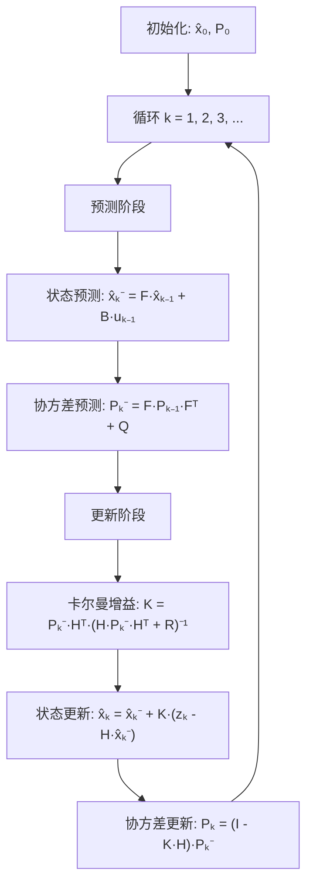
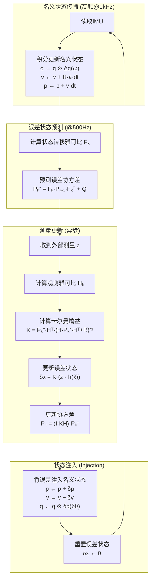

# 卡尔曼滤波详解——从直觉到公式

## 一、概述


### 1.1 什么是卡尔曼滤波？

用直白的话来讲，卡尔曼滤波就是：**你有多个不确定的结果，经过分析、推理和计算，获得相对准确的结果**。

- **多个**：数据来源可以是模型推理得出（如运动方程），也可以是仪器测量获得（如IMU、GPS）。
- **不确定**：模型本身是近似的，测量仪器存在精度误差，测量过程不可避免引入噪声。
- **分析、推理和计算**：这就是卡尔曼滤波算法本身。
- **相对准确**：结果比原有的多个不确定结果更逼近真实值，但依然存在误差。


### 1.2 应用场景

假设我们要估计无人机的高度：

| 数据来源     | 值              | 方差（不确定性）     | 说明                           |
| ------------ | --------------- | -------------------- | ------------------------------ |
| 运动模型预测 | $h_{预测}=1.0m$ | $\sigma_q^2=0.04m^2$ | 根据上一时刻高度+速度×时间推算 |
| 气压计测量   | $h_{气压}=1.1m$ | $\sigma_r^2=0.01m^2$ | MS5611气压计读数               |

问题：无人机的真实高度最可能是多少？

**直觉解法**：取平均值 $(1.0+1.1)/2=1.05m$？

**更好的解法**：既然气压计方差更小（更可信），应该给它更大的权重！

$$
h_{最优} = \frac{\sigma_r^2}{\sigma_r^2+\sigma_q^2} \cdot h_{预测} + \frac{\sigma_q^2}{\sigma_r^2+\sigma_q^2} \cdot h_{气压}
= \frac{0.01}{0.05} \times 1.0 + \frac{0.04}{0.05} \times 1.1 = 1.08m
$$

这个"方差越大权重越小"的直觉，正是卡尔曼滤波的核心思想！


## 二、数学建模

### 2.1 三个基本假设

线性卡尔曼滤波基于三个假设：

1. **马尔可夫性**：当前时刻状态只和上一时刻状态有关
2. **线性**：模型和系统均满足线性关系
3. **高斯噪声**：引入的噪声符合高斯分布

### 2.2 两个核心模型

#### 过程模型（运动方程）

$$
x_k = F x_{k-1} + B u_{k-1} + w_k \quad \text{……①}
$$

其中：
- $F$：状态转移矩阵，描述系统自身的演化规律
- $B$：控制输入矩阵，描述外部输入 $u_{k-1}$ 如何影响状态
- $u_{k-1}$：控制输入（如无人机的加速度、舵机指令等）
- $w_k$：过程噪声

以无人机高度估计为例：
- $x_k = \begin{bmatrix} h \\ v \end{bmatrix}$：状态向量（高度、垂直速度）
- $F = \begin{bmatrix} 1 & \Delta t \\ 0 & 1 \end{bmatrix}$：状态转移矩阵（匀速运动模型）
- $u_{k-1}$：控制输入（如油门对应的加速度）
- $w_k \sim N(0, Q)$：过程噪声（模型不完美带来的误差）


直观理解：$h_k = h_{k-1} + v_{k-1} \cdot \Delta t$（高度 = 上次高度 + 速度×时间）

#### 观测模型（测量方程）

$$
z_k = H x_k + v_k \quad \text{……②}
$$

以气压计为例：
- $z_k$：气压计测量的高度
- $H = \begin{bmatrix} 1 & 0 \end{bmatrix}$：观测矩阵（只能观测高度，不能直接观测速度）
- $v_k \sim N(0, R)$：测量噪声（传感器精度误差）

---
#### 严谨定义

卡尔曼滤波（Kalman Filter）是针对**线性系统**的最优递推状态估计算法。其严谨定义如下：

> **卡尔曼滤波是在已知系统线性状态空间模型、过程噪声和观测噪声均为高斯白噪声的前提下，给定所有历史观测，递推计算当前状态的最小均方误差（MMSE, Minimum Mean Square Error）估计的最优线性滤波器。**

数学描述：

$$
\begin{align}
&x_k = F x_{k-1} + B u_{k-1} + w_k \\
&z_k = H x_k + v_k
\end{align}
$$

其中 $w_k \sim N(0, Q)$，$v_k \sim N(0, R)$，且 $w_k$、$v_k$ 互相独立。

卡尔曼滤波的目标是：

$$
\hat{x}_k = \operatorname*{argmin}_{\tilde{x}_k} \, E\left[ \| x_k - \tilde{x}_k \|^2 \mid z_1, ..., z_k \right]
$$

即在所有历史观测 $z_1, ..., z_k$ 已知的条件下，递推地给出当前状态 $x_k$ 的最优线性无偏估计。对于线性高斯系统，卡尔曼滤波器是**全体滤波器中均方误差最小的（最优）**。


---


## 三、核心公式推导

### 3.1 预测值与最优估计值

由于噪声 $w_k$ 未知，我们用上一时刻的最优估计值 $\hat{x}_{k-1}$ 代替真实值，得到**预测值**（先验估计）：

$$
\hat{x}_k^- = F \hat{x}_{k-1} + B u_{k-1} \quad \text{……⑨}
$$

但这个预测值误差较大，需要用观测值修正。修正公式为：

$$
\hat{x}_k = \hat{x}_k^- + K(z_k - H\hat{x}_k^-) \quad \text{……③}
$$

#### ③ 修正公式如何得到？（从预测值与观测值两个角度）

把式③看成一句话：

> **后验估计 = 先验预测 + “按权重纠偏”**

其中“纠偏”来自观测与预测的不一致（新息），权重就是卡尔曼增益 $K$。

**角度A：从“预测值”出发（先猜，再用新息纠偏）**

1）先验预测 $\hat{x}_k^-$ 是你“按模型往前推”的结果，但不可避免有误差。

2）把先验预测映射到测量空间（你预测的测量应该是多少）：

$$
\hat{z}_k^- = H\hat{x}_k^-
$$

3）把真实测量 $z_k$ 和预测测量对比，得到**新息/残差**：

$$
r_k = z_k - \hat{z}_k^- = z_k - H\hat{x}_k^-
$$

4）用一个矩阵 $K$ 把“测量空间的误差”转换成“状态空间该修多少”，于是得到：

$$
\hat{x}_k = \hat{x}_k^- + K r_k
$$

这就是式③。此时式③的核心含义非常直观：**如果观测与预测差很多，就要修；修多少由 $K$ 决定。**

**角度B：从“观测值”出发（把观测当成另一个估计，再和预测做最优加权）**

观测模型是 $z_k = Hx_k + v_k$。当观测能“直接看见状态”时（最典型：$H=I$），观测本身就是一个带噪声的状态估计：

$$
\hat{x}_k^{(meas)} = z_k, \quad \text{其噪声为 } R
$$

此时式③可以改写为“预测估计”和“测量估计”的加权融合：

$$
\hat{x}_k = (I-K)\hat{x}_k^- + K z_k
$$

在一维情况下，最优 $K$ 会退化成我们熟悉的“按方差加权”的形式：

$$
K = \frac{P_k^-}{P_k^- + R}
$$

也就是：预测越不靠谱（$P_k^-$ 大）就越信观测；观测越不靠谱（$R$ 大）就越信预测。

当 $H\neq I$（观测只是状态的一部分或线性组合）时，你不能直接把 $z_k$ 当作状态，但“**先把预测投影到观测空间做对比（新息），再用 $K$ 把新息回写到状态**”依然成立，这就是式③在一般情形下的写法。

> 进一步严格推导 $K$ 的表达式（⑥），就是你后面做的那件事：把误差写出来（④），得到后验协方差（⑤），再让 $tr(P_k)$ 最小化求得最优 $K$。

其中：
- $\hat{x}_k$：**最优估计值**（后验估计）
- $K$：**卡尔曼增益**（待求解）
- $z_k - H\hat{x}_k^-$：**新息**（观测值与预测值的差异）

直观理解：最优值 = 预测值 + 卡尔曼增益 × (观测值 - 预测对应的观测)

### 3.2 误差与协方差矩阵

定义误差：
- 后验误差：$e_k = x_k - \hat{x}_k$（真实值与最优估计的差）
- 先验误差：$e_k^- = x_k - \hat{x}_k^-$（真实值与预测值的差）

将公式③代入，并用公式②替换 $z_k$：

$$
\begin{align}
e_k &= x_k - \hat{x}_k^- - K(z_k - H\hat{x}_k^-) \\
&= x_k - \hat{x}_k^- - K(Hx_k + v_k - H\hat{x}_k^-) \\
&= (I - KH)(x_k - \hat{x}_k^-) - Kv_k \\
&= (I - KH)e_k^- - Kv_k \quad \text{……④}
\end{align}
$$

定义**协方差矩阵**：
- $P_k = E[e_k e_k^T]$：后验误差协方差
- $P_k^- = E[e_k^- e_k^{-T}]$：先验误差协方差

对公式④两边乘以自身转置并取期望（利用 $v_k$ 与 $e_k^-$ 独立）：

$$
P_k = (I-KH)P_k^-(I-KH)^T + KRK^T \quad \text{……⑤}
$$

展开后：

$$
P_k = P_k^- - KHP_k^- - P_k^-H^TK^T + K(HP_k^-H^T + R)K^T
$$

### 3.3 卡尔曼增益的求解

目标：找到 $K$ 使得误差最小，即最小化 $tr(P_k)$（协方差矩阵的迹 = 各状态方差之和）。

对 $tr(P_k)$ 关于 $K$ 求导并令其为零：

$$
\frac{\partial tr(P_k)}{\partial K} = -2P_k^-H^T + 2K(HP_k^-H^T + R) = 0
$$

解得**卡尔曼增益**：

$$
\boxed{K = P_k^- H^T (HP_k^-H^T + R)^{-1}} \quad \text{……⑥}
$$

将⑥代入⑤，简化得**后验协方差**：

$$
\boxed{P_k = (I - KH)P_k^-} \quad \text{……⑦}
$$

### 3.4 先验协方差的递推

类似地，对预测值公式⑨进行误差分析：

$$
e_k^- = x_k - \hat{x}_k^- = F(x_{k-1} - \hat{x}_{k-1}) + w_k = Fe_{k-1} + w_k
$$

取协方差得**先验协方差递推公式**：

$$
\boxed{P_k^- = FP_{k-1}F^T + Q} \quad \text{……⑧}
$$

---

### 3.5 这些公式之间到底是什么关系？

把这一节看成两条并行的“流水线”：

- **状态流水线（算“现在是多少”）**：先用模型得到预测值（⑨），再用观测把它拉回最优估计（③）。
- **不确定度流水线（算“我有多自信”）**：先把上一时刻的不确定度传播到当前并加上模型噪声（⑧），再根据观测把不确定度同步缩小/调整（⑤→⑦）。

它们之间的关键连接点是 **卡尔曼增益 $K$（⑥）**：

- $K$ 用 **预测的不确定度 $P_k^-$** 和 **观测噪声 $R$** 自动算出“相信观测的力度”。
- 预测越不自信（$P_k^-$ 大）→ $K$ 越大 → 更听观测；观测越不靠谱（$R$ 大）→ $K$ 越小 → 更听模型。

把公式按“先预测后更新”串起来就是：

1. **模型与观测的前提**：真实世界按过程模型走（①），传感器按观测模型测（②）。
2. **预测（先验）**：
    - 先验状态：$\hat{x}_k^-$（⑨）
    - 先验协方差：$P_k^-$（⑧）
3. **计算权重**：由 $P_k^-$、$H$、$R$ 得到 $K$（⑥）。
4. **更新（后验）**：
    - 用“新息”$z_k - H\hat{x}_k^-$ 修正状态得到 $\hat{x}_k$（③）
    - 误差怎么被修正由误差公式表达（④），进而推出后验协方差完整形式（⑤），常用简化为（⑦）。

一句话记忆：**⑨⑧ 负责“先猜并承认不确定”，⑥ 负责“算该听谁”，③⑦ 负责“拉回并更新自信”。**


## 四、卡尔曼增益的直观理解

$$
K = \frac{P_k^- H^T}{HP_k^-H^T + R}
$$

分析两种极端情况：

| 情况                          | $K$ 值         | 最优估计                    | 含义           |
| ----------------------------- | -------------- | --------------------------- | -------------- |
| $R \to 0$（测量完全可信）     | $K \to H^{-1}$ | $\hat{x}_k \to H^{-1}z_k$   | 完全相信观测值 |
| $P_k^- \to 0$（预测完全可信） | $K \to 0$      | $\hat{x}_k \to \hat{x}_k^-$ | 完全相信预测值 |

这正是我们直觉的数学表达：**谁的方差小，就更相信谁**！

---

## 五、完整算法流程



---

## 六、公式汇总

| 公式         | 表达式                                            | 说明         |
| ------------ | ------------------------------------------------- | ------------ |
| ① 过程模型   | $x_k = Fx_{k-1} + Bu_{k-1} + w_k$                 | 真实状态演化 |
| ② 观测模型   | $z_k = Hx_k + v_k$                                | 传感器测量   |
| ⑨ 状态预测   | $\hat{x}_k^- = F\hat{x}_{k-1} + Bu_{k-1}$         | 先验估计     |
| ⑧ 协方差预测 | $P_k^- = FP_{k-1}F^T + Q$                         | 先验协方差   |
| ⑥ 卡尔曼增益 | $K = P_k^-H^T(HP_k^-H^T+R)^{-1}$                  | 最优权重     |
| ③ 状态更新   | $\hat{x}_k = \hat{x}_k^- + K(z_k - H\hat{x}_k^-)$ | 后验估计     |
| ⑦ 协方差更新 | $P_k = (I-KH)P_k^-$                               | 后验协方差   |

#### 一维KF如何推广到多维KF？

只需把所有标量变量替换为向量/矩阵，所有乘法替换为矩阵乘法，公式结构不变。例如：

- 一维KF的状态预测：$\hat{x}_k^- = f \hat{x}_{k-1} + b u_{k-1}$
- 多维KF的状态预测：$\hat{x}_k^- = F \hat{x}_{k-1} + B u_{k-1}$

卡尔曼增益、协方差递推等同理。


#### 一维KF和多维KF的本质区别

卡尔曼滤波的所有公式（如状态预测、协方差预测、卡尔曼增益等）本质上都是**向量和矩阵**形式，适用于任意维数的状态空间。前面推导时，为了便于理解，常用1维或2维（如高度/速度）举例，但实际工程中，状态往往是多维的：

- **一维KF**：所有变量都是标量，$F$、$H$、$Q$、$R$、$P$ 都是数。
- **多维KF**：所有变量都是向量/矩阵，$F$、$H$、$Q$、$R$、$P$ 都是矩阵。

公式结构完全一致，只是矩阵/向量的维度不同。例如：

$$
\begin{align}
&\text{状态预测:}\quad \hat{x}_k^- = F \hat{x}_{k-1} + B u_{k-1} \\
&\text{协方差预测:}\quad P_k^- = F P_{k-1} F^T + Q \\
&\text{卡尔曼增益:}\quad K = P_k^- H^T (H P_k^- H^T + R)^{-1}
\end{align}
$$

如果 $x$ 是 $n$ 维向量，$F$ 是 $n\times n$ 矩阵，$P$、$Q$ 也是 $n\times n$，$H$ 是 $m\times n$，$R$ 是 $m\times m$，$z$ 是 $m$ 维观测。


### 6.1 KF里“调参”到底在调什么？（Q / R / P₀）

如果把卡尔曼滤波看成“在预测值和观测值之间做权衡”，那大部分调参本质上就在调三类东西：

#### 1）过程噪声协方差 $Q$（你有多相信运动模型）

- **含义**：模型没有写进来的东西（外界扰动、未建模加速度、IMU零偏变化等）。
- **调大 $Q$ 的效果**：认为“模型更不靠谱”，滤波器更愿意跟着观测走（响应更快，但更抖）。
- **调小 $Q$ 的效果**：认为“模型更靠谱”，滤波器更愿意按预测走（更平滑，但可能漂移、跟不上）。

#### 2）测量噪声协方差 $R$（你有多相信传感器）

- **含义**：测量的不确定性（如气压计噪声、光流抖动、UWB跳点）。
- **调大 $R$ 的效果**：认为“测量更不靠谱”，观测的修正力度变小（更稳但更“钝”）。
- **调小 $R$ 的效果**：认为“测量更靠谱”，观测的修正力度变大（收敛更快但更容易抖动/被异常点带偏）。

#### 3）初始协方差 $P_0$（你对“初始状态”的把握程度）

- **含义**：刚启动时，你到底有多确定初始位置/速度/姿态。
- **$P_0$ 大**：启动时“承认自己不知道”，更愿意快速被观测拉回（但初期可能更敏感）。
- **$P_0$ 小**：启动时“自信很强”，更依赖初始值（但如果初值错，会更难拉回来）。

#### 4）常见调参顺序（经验）

1. **先把传感器本身搞对**：标定、坐标系、方向、单位、时间戳/频率。
2. **先让滤波不发散**：适当增大 $R$（降低对观测的信任），或增大 $Q$（承认模型不准）取决于你看到的现象。
3. **再在“稳定 vs 灵敏”之间取平衡**：
    - 抖得厉害：增大对应观测的 $R$ 或减小对应过程的 $Q$
    - 跟不上/漂移：减小 $R$ 或增大 $Q$


---

## 七、扩展卡尔曼滤波（EKF）

实际工程中很少直接使用线性卡尔曼滤波，因为大多数系统是非线性的。

### 7.1 非线性问题

对于非线性系统：
$$
\begin{align}
x_k &= f(x_{k-1}, u_{k-1}) + w_k \\
z_k &= h(x_k) + v_k
\end{align}
$$

其中 $f(\cdot)$ 和 $h(\cdot)$ 是非线性函数，无法直接应用线性KF。

### 7.2 EKF的核心思想：线性化

EKF的解决方案是对非线性函数进行**一阶泰勒展开**，在当前估计点附近线性化：

$$
\begin{align}
F_k &= \frac{\partial f}{\partial x}\bigg|_{\hat{x}_{k-1}} \quad \text{（状态转移雅可比矩阵）} \\
H_k &= \frac{\partial h}{\partial x}\bigg|_{\hat{x}_k^-} \quad \text{（观测雅可比矩阵）}
\end{align}
$$

然后用 $F_k$、$H_k$ 替代原来的常数矩阵 $F$、$H$，其余公式保持不变。

### 7.3 EKF vs KF 对比

| 特性       | 线性KF           | 扩展KF (EKF)                  |
| ---------- | ---------------- | ----------------------------- |
| 系统模型   | 线性             | 非线性                        |
| 状态转移   | $F$（常数矩阵）  | $F_k$（雅可比矩阵，每步计算） |
| 观测模型   | $H$（常数矩阵）  | $H_k$（雅可比矩阵，每步计算） |
| 计算复杂度 | 低               | 较高（需求导）                |
| 精度       | 最优（线性系统） | 近似最优（依赖线性化精度）    |

---

## 八、本项目的卡尔曼滤波实现

### 8.1 实现类型：误差状态扩展卡尔曼滤波（ESKF）

本项目使用的是 **ESKF（Error-State Kalman Filter）**，这是EKF的一种变体，专门用于姿态估计。

#### ESKF vs 标准EKF

| 特性       | 标准EKF         | ESKF（本项目）        |
| ---------- | --------------- | --------------------- |
| 估计对象   | 状态本身 $x$    | 状态误差 $\delta x$   |
| 姿态表示   | 直接估计四元数  | 估计四元数误差（3维） |
| 数值稳定性 | 可能发散        | 更稳定                |
| 状态维度   | 需要4维表示姿态 | 只需3维误差           |

#### 为什么用ESKF？

四元数有4个分量但只有3个自由度（需满足单位约束），直接估计会引入冗余。ESKF通过估计3维误差向量，避免了这个问题。

#### 项目用9维状态

本项目的状态向量 $x$ 包含了无人机的**位置、速度、姿态误差**等9个物理量：

- $[\delta x, \delta y, \delta z]$：位置误差（世界坐标）
- $[\delta v_x, \delta v_y, \delta v_z]$：速度误差（机体坐标）
- $[\delta \theta_0, \delta \theta_1, \delta \theta_2]$：姿态误差（误差四元数的3维参数）

这样设计的原因：

- **无人机的运动状态本身就是多维的**，需要同时估计空间位置、速度和姿态。
- **误差状态扩展卡尔曼滤波（ESKF）**专门用9维来描述这些误差，便于融合IMU、气压计、光流等多种传感器。
- **多维KF能同时处理变量间的相关性**（如位置和速度的耦合、姿态误差对速度估计的影响），这在实际飞控中非常重要。


**结论**：

- KF的本质是“递推最优估计”，一维/多维只是状态空间的维度不同，所有公式都天然支持多维。
- 项目用9维，是因为无人机的实际状态需要9个变量才能完整描述。


### 8.2 状态向量定义

代码中的9维状态向量（`coreData.S[9]`）：

```
┌─────────────────────────────────────────────────────────────┐
│ 名义状态 (Nominal State)                                    │
│   位置: q (四元数), p (位置向量), v (速度向量)              │
│                                                             │
│ 误差状态 (Error State) - 卡尔曼滤波估计的对象               │
├─────────────────────────────────────────────────────────────┤
│ S[0] = KC_STATE_X   │ δx  │ X位置误差 (世界坐标系, 米)      │
│ S[1] = KC_STATE_Y   │ δy  │ Y位置误差                       │
│ S[2] = KC_STATE_Z   │ δz  │ Z位置误差（高度）               │
├─────────────────────────────────────────────────────────────┤
│ S[3] = KC_STATE_PX  │ δvx │ X速度误差 (机体坐标系, m/s)     │
│ S[4] = KC_STATE_PY  │ δvy │ Y速度误差                       │
│ S[5] = KC_STATE_PZ  │ δvz │ Z速度误差                       │
├─────────────────────────────────────────────────────────────┤
│ S[6] = KC_STATE_D0  │ δθ₀ │ 姿态误差分量0 (误差四元数)      │
│ S[7] = KC_STATE_D1  │ δθ₁ │ 姿态误差分量1                   │
│ S[8] = KC_STATE_D2  │ δθ₂ │ 姿态误差分量2                   │
└─────────────────────────────────────────────────────────────┘
```

### 8.3 ESKF工作流程



### 8.4 代码对应关系

| ESKF步骤     | 代码函数                             | 文件位置                  | 频率  |
| ------------ | ------------------------------------ | ------------------------- | ----- |
| 名义状态传播 | `estimatorKalman()` 中累积IMU        | `estimator_kalman_task.c` | ~1kHz |
| 误差状态预测 | `kalmanCorePredict()`                | `kalman_core.c`           | 500Hz |
| 过程噪声添加 | `kalmanCoreAddProcessNoise()`        | `kalman_core.c`           | 随dt  |
| TOF测量更新  | `kalmanCoreUpdateWithTof()`          | `kalman_core.c`           | 异步  |
| 速度测量更新 | `kalmanCoreUpdateWithVelocity()`     | `kalman_core.c`           | 异步  |
| 位置测量更新 | `kalmanCoreUpdateWithPosition()`     | `kalman_core.c`           | 异步  |
| 状态注入     | `kalmanCoreFinalize()`               | `kalman_core.c`           | 触发时 |
| 状态导出     | `kalmanCoreExternalizeState()`       | `kalman_core.c`           | 每轮  |

### 8.5 关键数据结构

```c
// kalman_core.h
typedef struct {
    float S[KC_STATE_DIM];      // 误差状态向量 (9维)
    float P[KC_STATE_DIM][KC_STATE_DIM];  // 协方差矩阵 (9×9)
    float q[4];                 // 名义姿态四元数
    float R[3][3];              // 旋转矩阵 (机体→世界)
    bool resetEstimation;       // 重置标志
} kalmanCoreData_t;
```

### 8.6 传感器融合

本项目支持多种传感器的异步融合：

```mermaid
flowchart LR
    subgraph 高频传感器["高频传感器 (必需)"]
        IMU[BMI088<br/>加速度计+陀螺仪<br/>@1kHz]
    end

    subgraph 辅助传感器["辅助传感器 (可选)"]
        BARO[MS5611 气压计<br/>@50Hz]
        TOF[VL53L1 激光测距<br/>@异步]
        FLOW[MTF01 速度量测<br/>@异步]
        UWB[UWB 超宽带<br/>@异步]
    end

    subgraph ESKF["ESKF 滤波器"]
        PRED[预测<br/>kalmanCorePredict]
        UPD[更新<br/>kalmanCoreUpdate*]
    end

    IMU -->|名义状态传播| PRED
    IMU -->|误差协方差预测| PRED
    BARO -->|高度校正| UPD
    TOF -->|高度校正| UPD
    FLOW -->|机体系速度校正| UPD
    UWB -->|位置校正| UPD

    PRED --> UPD
```

### 8.7 为什么选择ESKF？

1. **数值稳定性**：四元数直接估计可能违反单位约束，ESKF避免此问题
2. **小误差假设**：误差状态通常很小，线性化更准确
3. **计算效率**：3维误差比4维四元数减少计算量
4. **广泛验证**：Crazyflie原始固件使用此方案，经过大量飞行验证

### 8.8 关键参数配置

```c
// estimator_kalman_task.c 中的关键常量
#define PREDICT_RATE RATE_500_HZ        // 预测频率
#define BARO_RATE RATE_50_HZ            // 气压计更新频率(启用Baro时)
#define ACCEL_ATTITUDE_RATE RATE_25_HZ  // 加速度姿态校正频率
#define IN_FLIGHT_THRUST_THRESHOLD 0.1g // 判定起飞的推力阈值
#define MAX_COVARIANCE 100              // 协方差上限（防止发散）
#define MIN_COVARIANCE 1e-6f            // 协方差下限
```

### 8.9 本项目里实际“调”的是什么？（对应到参数名）

本项目沿用 Crazyflie 的 **param 系统**，卡尔曼相关参数集中在 `kalman` 分组中。它们可以理解为把上一节的 $Q/R/P_0$ 具体化。

#### 8.9.1 过程噪声（对应 $Q$，影响“跟模型还是跟测量”）

在 [components/core/crazyflie/modules/src/kalman_core.c](components/core/crazyflie/modules/src/kalman_core.c) 中，`kalman` 分组提供了过程噪声项（内部用于构造/调节滤波过程噪声）：

- `kalman.pNAcc_xy`：水平向加速度相关过程噪声
- `kalman.pNAcc_z`：垂直向加速度相关过程噪声
- `kalman.pNVel`：速度相关过程噪声
- `kalman.pNPos`：位置相关过程噪声
- `kalman.pNAtt`：姿态相关过程噪声

怎么调（方向性的经验）：

- **估计太“飘”、漂移明显、转弯/加速时跟不上**：通常需要 **增大相关的过程噪声**（让滤波承认模型不足，允许状态更快变化）。
- **估计太“躁”、噪声被放大、速度/位置像在抖**：通常需要 **减小相关的过程噪声**（更强的模型约束）。

#### 8.9.2 测量噪声（对应 $R$，影响“每种传感器的权重”）

同样在 [components/core/crazyflie/modules/src/kalman_core.c](components/core/crazyflie/modules/src/kalman_core.c) 的 `kalman` 分组中：

- `kalman.mNBaro`：气压计测量噪声（用于高度/气压更新时的权重）
- `kalman.mNGyro_rollpitch`：陀螺 roll/pitch 相关测量噪声
- `kalman.mNGyro_yaw`：陀螺 yaw 相关测量噪声

怎么调（方向性的经验）：

- **高度（或姿态）被气压计/陀螺噪声带着抖**：增大对应 `mN*`（降低该测量的权重）。
- **高度（或姿态）长期漂移/收敛慢**：减小对应 `mN*`（提高该测量的权重）。

提示：如果你看到“偶发跳点”，优先考虑 **测量异常**（传感器、时间戳、外部定位质量），而不是盲目把 `mN*` 调到极小。

#### 8.9.3 初始条件（对应 $P_0$ / 初始状态）

在 [components/core/crazyflie/modules/src/kalman_core.c](components/core/crazyflie/modules/src/kalman_core.c) 的 `kalman` 分组中：

- `kalman.initialX` / `kalman.initialY` / `kalman.initialZ`
- `kalman.initialYaw`

这些不是 $P_0$ 本身，但它们会显著影响“启动时滤波器在什么地方开始”。当外部定位/重定位体系不完善时，初始值是否合理会直接决定开机后是否需要很长时间才能“拉回”。

#### 8.9.4 边界与安全（防发散/防离谱值）

- `kalman.maxPos` / `kalman.maxVel`：在 [components/core/crazyflie/modules/src/kalman_supervisor.c](components/core/crazyflie/modules/src/kalman_supervisor.c) 中定义，用于判定状态是否越界，越界会触发上层重置逻辑。
- `MAX_COVARIANCE` / `MIN_COVARIANCE`：在滤波内部对协方差做夹紧，避免数值发散或过度自信（见 [components/core/crazyflie/modules/src/kalman_core.c](components/core/crazyflie/modules/src/kalman_core.c)）。

调参建议：一般不建议把 `maxPos/maxVel` 放得很紧，否则正常飞行/外部测量短暂异常也可能被判越界导致频繁重置。

#### 8.9.5 运行时控制与调试（不是滤波参数，但很常用）

在 [components/core/crazyflie/modules/src/estimator_kalman.c](components/core/crazyflie/modules/src/estimator_kalman.c) 的 `kalman` 分组中：

- `kalman.resetEstimation`：置 1 触发滤波器重置（会被任务清回 0）
- `kalman.quadIsFlying`：飞行状态标志（影响动力学与噪声策略）

#### 8.9.6 观测“调参结果”的日志建议

调参一定要看量化指标，否则会陷入“感觉更稳/更飘”的主观循环。建议重点关注：

- `kalman.varX/varY/varZ/varPX/varPY/varPZ/...`：协方差对角线（你现在到底有多“自信”）
- `kalman.stateX/stateY/stateZ/...`：状态是否平滑、是否有跳
- `kalman.rtPred/rtUpdate/...`：预测/更新频率是否符合预期

一般来说：

- 协方差长期极小但状态明显错：通常是 **$R/Q 不匹配或某个观测被过度相信**。
- 协方差长期很大且状态漂：通常是 **观测太少/观测噪声设太大/模型约束太弱**。

---

## 九、卡尔曼滤波变种对比

| 类型      | 全称                      | 适用场景       | 本项目使用 |
| --------- | ------------------------- | -------------- | ---------- |
| **KF**    | Kalman Filter             | 线性系统       | ❌          |
| **EKF**   | Extended KF               | 非线性系统     | ⚠️ 基础     |
| **ESKF**  | Error-State KF            | 姿态估计       | ✅ 使用     |
| **UKF**   | Unscented KF              | 强非线性       | ❌          |
| **MSCKF** | Multi-State Constraint KF | 视觉惯性里程计 | ❌          |

---

## 十、参考资料

1. Mueller, M. W., Hamer, M., & D'Andrea, R. (2015). *Fusing ultra-wideband range measurements with accelerometers and rate gyroscopes for quadrocopter state estimation*. ICRA 2015.
2. Mueller, M. W., Hehn, M., & D'Andrea, R. (2016). *Covariance Correction Step for Kalman Filtering with an Attitude*. Journal of Guidance, Control, and Dynamics.
3. Solà, J. (2017). *Quaternion kinematics for the error-state Kalman filter*. arXiv:1711.02508.
4. Crazyflie Firmware: https://github.com/bitcraze/crazyflie-firmware
