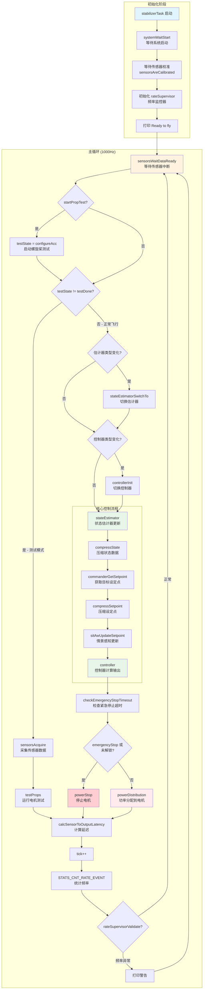
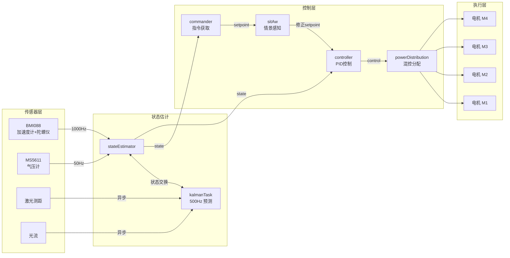
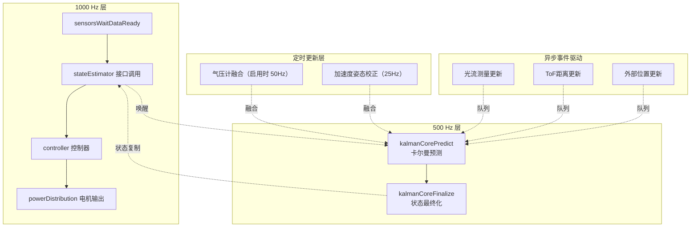
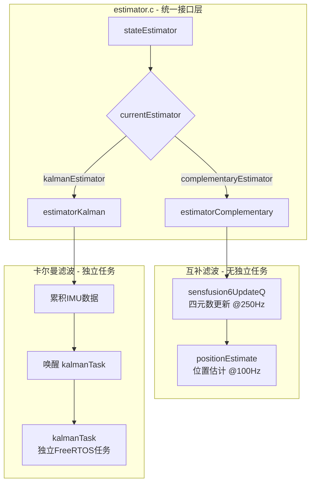
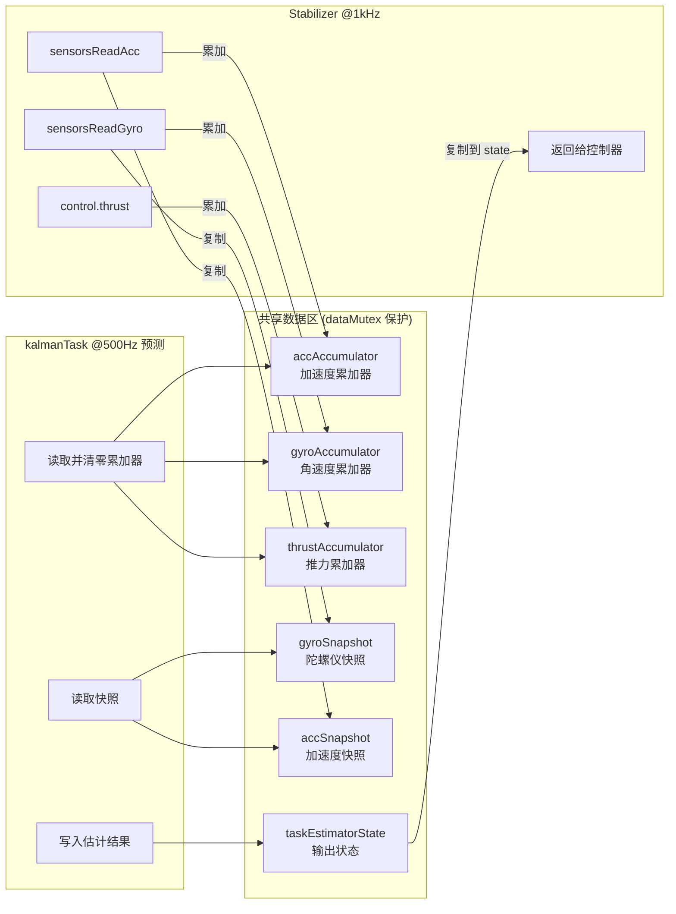
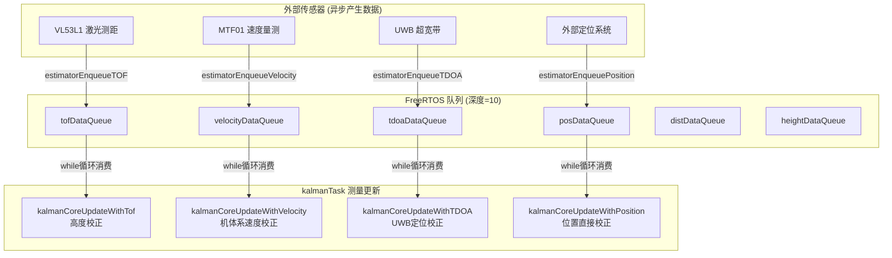

# 无人机控制流程

## stabilizerTask 主循环流程图



## 数据流向图



## 频率层次图



## 关键变量说明

| 变量            | 类型           | 说明                                |
| --------------- | -------------- | ----------------------------------- |
| `sensorData`    | `sensorData_t` | 传感器原始数据（IMU/气压计/磁力计） |
| `state`         | `state_t`      | 当前状态估计（姿态/位置/速度）      |
| `setpoint`      | `setpoint_t`   | 目标设定点（来自遥控/上位机）       |
| `control`       | `control_t`    | 控制器输出（roll/pitch/yaw/thrust） |
| `tick`          | `uint32_t`     | 循环计数器                          |
| `emergencyStop` | `bool`         | 紧急停止标志                        |
| `testState`     | `TestState`    | 螺旋桨测试状态机                    |

---

## 状态估计系统详解

系统支持两种状态估计器，通过函数指针表实现运行时切换：

### 估计器选择架构



### 估计器对比

| 特性           | 互补滤波         | 卡尔曼滤波                |
| -------------- | ---------------- | ------------------------- |
| **独立任务**   | ❌ 无（函数调用） | ✅ 有（kalmanTask）        |
| **状态维度**   | 3维（仅姿态）    | 9维（位置+速度+姿态误差） |
| **传感器融合** | 简单加权混合     | 协方差最优估计            |
| **外部传感器** | 仅TOF            | TOF/光流/UWB/外部位置等   |
| **CPU开销**    | 低               | 较高                      |
| **适用场景**   | 基础姿态稳定     | 定点悬停/自主飞行         |
| **默认选择**   | 作为备选           | ✅ 当前系统默认            |

---

## 卡尔曼滤波器详解

### 双任务协作架构

卡尔曼滤波采用**生产者-消费者**模式，分离高频数据采集与计算密集型滤波：

```mermaid
flowchart TB
    subgraph StabilizerLoop["Stabilizer 主循环 @1000Hz"]
        A[传感器数据就绪] --> B["estimatorKalman()"]
        B --> C["累积 acc/gyro 到累加器"]
        C --> D["累积 thrust 推力命令"]
        D --> E["复制 taskEstimatorState → state"]
        E --> F["xSemaphoreGive(runTaskSemaphore)"]
    end

    subgraph KalmanTask["kalmanTask 独立任务"]
        G["xSemaphoreTake(runTaskSemaphore)"] --> H{"resetEstimation?"}
        H -->|是| H1[estimatorKalmanInit 重置]
        H -->|否| I
        H1 --> I
        
        I{"osTick >= nextPrediction?"}
        I -->|是 @500Hz| J[predictStateForward]
        I -->|否| K[跳过预测]
        
        J --> J1["计算 gyro/acc 平均值"]
        J1 --> J2["kalmanCorePredict 状态预测"]
        J2 --> J3["清零累加器"]
        J3 --> L
        K --> L
        
        L[kalmanCoreAddProcessNoise] --> M{"useBaroUpdate?"}
        M -->|是 @50Hz| M1[kalmanCoreUpdateWithBaro]
        M -->|否| N
        M1 --> N

        N --> N0[updateAccelAttitudeIfReady @25Hz]
        N0 --> N1
        
        N1[updateQueuedMeasurements] --> N2{"有TOF?"}
        N2 -->|是| N3[kalmanCoreUpdateWithTof]
        N2 -->|否| N4{"有速度量测?"}
        N3 --> N4
        N4 -->|是| N5[kalmanCoreUpdateWithVelocity]
        N4 -->|否| N6{"有位置?"}
        N5 --> N6
        N6 -->|是| N7[kalmanCoreUpdateWithPosition]
        N6 -->|否| O
        N7 --> O
        
        O{"doneUpdate?"}
        O -->|是| P[kalmanCoreFinalize]
        O -->|否| Q
        P --> P1["姿态误差归入四元数"]
        P1 --> P2["更新旋转矩阵 R"]
        P2 --> P3["协方差边界检查"]
        P3 --> Q
        
        Q[kalmanCoreExternalizeState] --> R["导出到 taskEstimatorState"]
        R --> G
    end

    F -.->|信号量| G
    R -.->|下次循环读取| E

    style B fill:#e3f2fd
    style J fill:#e8f5e9
    style N fill:#fff3e0
    style P fill:#fce4ec
```



### 数据同步机制



### 卡尔曼状态向量

滤波器估计9维状态向量：

```
状态向量 S[9]:
┌─────────────────────────────────────────────────────────┐
│ S[0] = KC_STATE_X   │ X位置 (世界坐标系, 米)            │
│ S[1] = KC_STATE_Y   │ Y位置 (世界坐标系, 米)            │
│ S[2] = KC_STATE_Z   │ Z位置 (世界坐标系, 米)            │
├─────────────────────────────────────────────────────────┤
│ S[3] = KC_STATE_PX  │ X速度 (机体坐标系, m/s)           │
│ S[4] = KC_STATE_PY  │ Y速度 (机体坐标系, m/s)           │
│ S[5] = KC_STATE_PZ  │ Z速度 (机体坐标系, m/s)           │
├─────────────────────────────────────────────────────────┤
│ S[6] = KC_STATE_D0  │ 姿态误差分量0 (误差四元数)        │
│ S[7] = KC_STATE_D1  │ 姿态误差分量1 (误差四元数)        │
│ S[8] = KC_STATE_D2  │ 姿态误差分量2 (误差四元数)        │
└─────────────────────────────────────────────────────────┘

协方差矩阵 P[9][9]: 状态不确定性估计
四元数 q[4]: 当前姿态四元数
旋转矩阵 R[3][3]: 机体到世界坐标系变换
```

### 测量更新队列系统

外部传感器通过队列异步送入滤波器：



### 预测步骤详解 (predictStateForward)

```c
// 核心逻辑伪代码
bool predictStateForward(uint32_t osTick, float dt) {
    // 1. 检查数据有效性
    if (gyroAccumulatorCount == 0 || accAccumulatorCount == 0)
        return false;
    
    // 2. 计算累积期间的平均值
    gyroAverage = gyroAccumulator / gyroAccumulatorCount * DEG_TO_RAD;  // deg/s → rad/s
    accAverage = accAccumulator / accAccumulatorCount * GRAVITY;        // G → m/s²
    thrustAverage = thrustAccumulator / thrustAccumulatorCount;
    
    // 3. 清零累加器，准备下一轮累积
    accAccumulator = {0};  accAccumulatorCount = 0;
    gyroAccumulator = {0}; gyroAccumulatorCount = 0;
    
    // 4. 判断飞行状态 (影响过程噪声)
    if (thrustAverage > IN_FLIGHT_THRUST_THRESHOLD)
        quadIsFlying = true;
    
    // 5. 执行卡尔曼预测
    kalmanCorePredict(&coreData, thrustAverage, &accAverage, &gyroAverage, dt, quadIsFlying);
    
    return true;
}
```

### 频率分层总结

| 层级         | 频率   | 操作                           | 说明                   |
| ------------ | ------ | ------------------------------ | ---------------------- |
| **IMU采样**  | 1000Hz | `estimatorKalman()`            | 累积acc/gyro，复制状态 |
| **状态预测** | 500Hz  | `predictStateForward()`        | 运动学前向传播         |
| **测量更新** | 按需   | `updateQueuedMeasurments()`    | 消费队列中的外部测量   |
| **气压计**   | 50Hz   | `kalmanCoreUpdateWithBaro()`   | 高度辅助（可选）       |
| **状态导出** | 每轮   | `kalmanCoreExternalizeState()` | 写入共享状态           |

### 关键常量定义

| 常量                         | 值    | 说明                           |
| ---------------------------- | ----- | ------------------------------ |
| `PREDICT_RATE`               | 500Hz | 卡尔曼预测频率                 |
| `BARO_RATE`                  | 50Hz  | 气压计更新频率（启用时）       |
| `ACCEL_ATTITUDE_RATE`        | 25Hz  | 加速度姿态校正频率             |
| `IN_FLIGHT_THRUST_THRESHOLD` | 0.1g  | 判定起飞的推力阈值             |
| `IN_FLIGHT_TIME_THRESHOLD`   | 500ms | 推力低于阈值后仍视为飞行的时间 |
| `MAX_COVARIANCE`             | 100   | 协方差上限                     |
| `MIN_COVARIANCE`             | 1e-6  | 协方差下限                     |

---

## 混控流程图 (powerDistribution)

