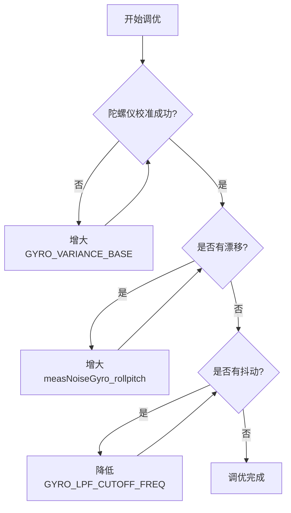

# ESP-Drone 姿态解算参数调节指南

> 文档版本: v1.0  
> 最后更新: 2025-12-25  
> 适用于: BMI088 + MS5611 (无气压计模式)

---

## 📖 概述

本文档详细列出 ESP-Drone 项目中所有与 **姿态解算** 相关的可调参数，帮助开发者针对不同硬件配置和飞行需求进行精确调优。

### 当前系统配置
- **IMU**: BMI088 (SPI接口)
- **气压计**: MS5611 (已禁用，`skipBaroCheck=1`)
- **控制频率**: 1000Hz
- **Kalman滤波器更新**: 100Hz
- **陀螺仪噪声特性**: 0.014 °/s/√Hz (BMI088) vs 0.005 °/s/√Hz (MPU6050)

---

## 1. Kalman滤波器核心参数

**文件位置**: [`components/core/crazyflie/modules/src/kalman_core.c`](../components/core/crazyflie/modules/src/kalman_core.c)

### 1.1 测量噪声参数

| 参数名                    | 当前值   | 单位  | 说明                       | 调节建议                                                                                |
| ------------------------- | -------- | ----- | -------------------------- | --------------------------------------------------------------------------------------- |
| `measNoiseGyro_rollpitch` | **2.0f** | rad/s | 陀螺仪Roll/Pitch轴测量噪声 | 增大→减弱重力校正，允许维持非水平姿态<br>减小→增强校正，减少漂移<br>推荐范围: 0.1 ~ 3.0 |
| `measNoiseGyro_yaw`       | **0.5f** | rad/s | 陀螺仪Yaw轴测量噪声        | 增大→Yaw响应变慢，减少短期抖动<br>推荐范围: 0.1 ~ 2.0                                   |
| `measNoiseBaro`           | 2.0f     | m     | 气压计测量噪声             | ⚠️ 无气压计时不生效                                                                      |

> **💡 关键理解**: 
> - `measNoiseGyro` **越大** → 滤波器越"不信任"陀螺仪，更依赖加速度计重力校正 → **减少长期漂移，但会被拉回水平**
> - `measNoiseGyro` **越小** → 滤波器信任陀螺仪积分 → **允许维持任意姿态，但有漂移**
> - **当前设置 (2.0)**: 适用于测试/展示，允许IMU维持旋转后的姿态

#### 运行时调节
可通过地面站参数系统实时修改（无需重新编译）：
```c
// 通过CRTP参数系统修改
kalman.mNGyro_rollpitch = 1.0f;  // 实时调整
kalman.mNGyro_yaw = 1.0f;
```

---

### 1.2 过程噪声参数

| 参数名            | 当前值 | 单位 | 说明                 |
| ----------------- | ------ | ---- | -------------------- |
| `procNoiseAcc_xy` | 0.5f   | m/s² | 加速度计XY轴过程噪声 |
| `procNoiseAcc_z`  | 1.0f   | m/s² | 加速度计Z轴过程噪声  |
| `procNoiseVel`    | 0      | m/s  | 速度过程噪声         |
| `procNoisePos`    | 0      | m    | 位置过程噪声         |
| `procNoiseAtt`    | **0**  | rad  | 姿态过程噪声         |

> ⚠️ **注意**: 过程噪声主要影响**位置估计**，对纯姿态控制影响较小。

### 1.4 姿态回归控制参数

**文件位置**: [`components/core/crazyflie/modules/src/kalman_core.c`](../components/core/crazyflie/modules/src/kalman_core.c)

| 参数名                     | 当前值   | 单位 | 说明                                                   |
| -------------------------- | -------- | ---- | ------------------------------------------------------ |
| `ROLLPITCH_ZERO_REVERSION` | **0.0f** | -    | 非飞行状态强制回归水平的速率（0=禁用，0.001=缓慢回归） |

**重要说明**:
- **0.0f (当前)**: 完全禁用强制水平，允许IMU维持任意姿态 → **适用于测试/展示**
- **0.001f (原值)**: 每次更新将Roll/Pitch拉回水平0.1% → **适用于飞行，防止累积误差**
- **影响**: 与`measNoiseGyro`配合工作，共同决定姿态保持特性

```c
// 代码实现位置 (kalman_core.c 约第887行)
if (!quadIsFlying) {
    float keep = 1.0f - ROLLPITCH_ZERO_REVERSION;
    tmpq0 = keep * tmpq0 + ROLLPITCH_ZERO_REVERSION * initialQuaternion[0];
    // ... 对q1, q2, q3同样处理
}
```

---

### 1.3 初始状态参数

| 参数名       | 当前值 | 说明              |
| ------------ | ------ | ----------------- |
| `initialX`   | 0.0    | 初始X位置 (m)     |
| `initialY`   | 0.0    | 初始Y位置 (m)     |
| `initialZ`   | 0.0    | 初始Z位置 (m)     |
| `initialYaw` | 0.0    | 初始Yaw角度 (rad) |

---

## 2. 传感器数据预处理

**文件位置**: [`components/core/crazyflie/hal/src/sensors_bmi088_spi_ms5611.c`](../components/core/crazyflie/hal/src/sensors_bmi088_spi_ms5611.c)

### 2.1 低通滤波器参数

| 参数名                  | 当前值    | 说明                     | 调节效果                                   |
| ----------------------- | --------- | ------------------------ | ------------------------------------------ |
| `GYRO_LPF_CUTOFF_FREQ`  | **50 Hz** | 陀螺仪低通滤波截止频率   | ↓降低→更平滑，延迟↑<br>↑升高→响应快，噪声↑ |
| `ACCEL_LPF_CUTOFF_FREQ` | **20 Hz** | 加速度计低通滤波截止频率 | ↓降低→减少振动干扰<br>↑升高→快速响应       |

**实现**: 二阶低通滤波器 (Butterworth)

```c
// 初始化示例代码 (已实现)
for (uint8_t i = 0; i < 3; i++)
{
  lpf2pInit(&gyroLpf[i], SENSORS_READ_RATE_HZ, GYRO_LPF_CUTOFF_FREQ);
  lpf2pInit(&accLpf[i], SENSORS_READ_RATE_HZ, ACCEL_LPF_CUTOFF_FREQ);
}
```

---

### 2.2 陀螺仪校准参数

| 参数名                        | 当前值   | 说明                           |
| ----------------------------- | -------- | ------------------------------ |
| `GYRO_VARIANCE_BASE`          | **3000** | 方差阈值（适配BMI088噪声特性） |
| `GYRO_VARIANCE_THRESHOLD_X`   | 3000     | X轴方差阈值                    |
| `GYRO_VARIANCE_THRESHOLD_Y`   | 3000     | Y轴方差阈值                    |
| `GYRO_VARIANCE_THRESHOLD_Z`   | 3000     | Z轴方差阈值                    |
| `SENSORS_NBR_OF_BIAS_SAMPLES` | 1024     | 零偏校准采样数                 |

> **技术背景**: BMI088噪声密度 (0.014 °/s/√Hz) 约为MPU6050 (0.005 °/s/√Hz) 的3倍，因此需要更宽松的阈值。

#### 调节建议
- **校准失败**: 增大 `GYRO_VARIANCE_BASE` (如 5000)
- **漂移严重**: 减小阈值并增加采样数 (如 2048)

---

### 2.3 IMU安装校准

**文件位置**: [`main/Kconfig.projbuild`](../main/Kconfig.projbuild)

| 配置项               | 单位  | 默认值 | 调节方法                                  |
| -------------------- | ----- | ------ | ----------------------------------------- |
| `CONFIG_PITCH_CALIB` | 0.01° | 0      | `idf.py menuconfig` → Drone Configuration |
| `CONFIG_ROLL_CALIB`  | 0.01° | 0      | 同上                                      |

**代码实现**:
```c
#define PITCH_CALIB (CONFIG_PITCH_CALIB * 1.0 / 100)  // 转换为度
#define ROLL_CALIB (CONFIG_ROLL_CALIB * 1.0 / 100)

// 运行时计算旋转矩阵
cosPitch = cosf(PITCH_CALIB * (float)M_PI / 180);
sinPitch = sinf(PITCH_CALIB * (float)M_PI / 180);
cosRoll = cosf(ROLL_CALIB * (float)M_PI / 180);
sinRoll = sinf(ROLL_CALIB * (float)M_PI / 180);
```

---

## 3. Kalman状态监督

**文件位置**: [`components/core/crazyflie/modules/src/kalman_supervisor.c`](../components/core/crazyflie/modules/src/kalman_supervisor.c)

### 3.1 状态边界检查

| 参数名        | 当前值       | 说明               | 设置原因                                   |
| ------------- | ------------ | ------------------ | ------------------------------------------ |
| `maxPosition` | **0 (禁用)** | 位置最大边界 (m)   | 无气压计/光流时位置会发散，设为0防止误触发 |
| `maxVelocity` | **0 (禁用)** | 速度最大边界 (m/s) | 同上                                       |

> **⚠️ 重要**: 启用边界检查需同时配备高度传感器（气压计/光流）或UWB定位。

---

## 4. BMI088硬件配置

**文件位置**: [`components/drivers/spi_devices/bmi088/include/bmi088_config.h`](../components/drivers/spi_devices/bmi088/include/bmi088_config.h)

### 4.1 加速度计配置

| 参数                      | 当前值     | 可选值           | 说明                     |
| ------------------------- | ---------- | ---------------- | ------------------------ |
| `BMI088_CONFIG_ACC_RANGE` | **6G**     | 3G/6G/12G/24G    | 量程越小，灵敏度越高     |
| `BMI088_CONFIG_ACC_ODR`   | **1600Hz** | 12.5Hz ~ 1600Hz  | 输出数据率               |
| `BMI088_CONFIG_ACC_BWP`   | **OSR4**   | OSR4/OSR2/NORMAL | OSR4=过采样4倍(最低噪声) |

### 4.2 陀螺仪配置

| 参数                       | 当前值           | 可选值                    | 说明                  |
| -------------------------- | ---------------- | ------------------------- | --------------------- |
| `BMI088_CONFIG_GYRO_RANGE` | **1000DPS**      | 125/250/500/1000/2000 DPS | 平稳飞行推荐1000DPS   |
| `BMI088_CONFIG_GYRO_BW`    | **116Hz/1000Hz** | 见下表                    | 带宽116Hz, ODR 1000Hz |

#### 陀螺仪带宽选项
| 枚举值                               | 滤波器带宽 | ODR        | 延迟      |
| ------------------------------------ | ---------- | ---------- | --------- |
| `BMI088_GYRO_BW_532_ODR_2000_HZ`     | 532Hz      | 2000Hz     | 0.3ms     |
| `BMI088_GYRO_BW_230_ODR_2000_HZ`     | 230Hz      | 2000Hz     | 0.6ms     |
| **`BMI088_GYRO_BW_116_ODR_1000_HZ`** | **116Hz**  | **1000Hz** | **0.9ms** |
| `BMI088_GYRO_BW_47_ODR_400_HZ`       | 47Hz       | 400Hz      | 2.8ms     |

---

## 5. 调试与优化流程

### 5.1 问题诊断表

| 症状                     | 可能原因           | 调节参数                                                                                 |
| ------------------------ | ------------------ | ---------------------------------------------------------------------------------------- |
| 静止时姿态缓慢漂移       | 陀螺仪积分误差累积 | ↓ `measNoiseGyro_rollpitch` (2.0 → 0.5)                                                  |
| **旋转后无法维持新姿态** | **重力校正过强**   | **↑ `measNoiseGyro_rollpitch` (0.5 → 2.0)**<br>**设置 `ROLLPITCH_ZERO_REVERSION = 0.0`** |
| 姿态响应迟钝             | 滤波器过度平滑     | ↓ `measNoiseGyro_rollpitch` (2.0 → 0.5)                                                  |
| 高频抖动                 | 传感器噪声         | ↓ `GYRO_LPF_CUTOFF_FREQ` (50 → 30Hz)                                                     |
| 校准失败                 | 方差阈值过严       | ↑ `GYRO_VARIANCE_BASE` (3000 → 5000)                                                     |
| 位置估计发散触发重置     | 边界检查误触发     | 设置 `maxPosition=0` 禁用                                                                |

---

### 5.2 推荐调优顺序



**步骤详解**:
1. **确保校准通过**: 检查日志 `gyro variance` 是否满足阈值
2. **测试静态漂移**: IMU静止放置1分钟，观察EULER角度变化
3. **调节Kalman参数**: 优先调整 `measNoiseGyro_rollpitch`
4. **优化滤波器**: 根据飞行表现微调LPF截止频率
5. **验证动态响应**: 手动晃动测试响应速度

---

### 5.3 参数修改方式

#### 方式1: 编译时修改（永久）
```c
// 修改 kalman_core.c
static float measNoiseGyro_rollpitch = 1.0f;  // 原值 0.5f
```

#### 方式2: 运行时修改（临时）
```python
# 通过cfclient地面站
kalman.mNGyro_rollpitch = 1.0
```

#### 方式3: 配置文件修改（推荐）
```bash
idf.py menuconfig
# → Drone Configuration → IMU Calibration
```

---

## 6. 常见配置场景

### 场景1: 测试/展示模式（维持任意姿态）
```c
// Kalman参数 - 允许IMU维持旋转后的姿态
measNoiseGyro_rollpitch = 2.0f;   // 大幅减弱重力校正
measNoiseGyro_yaw = 0.5f;

// 姿态回归控制
ROLLPITCH_ZERO_REVERSION = 0.0f;  // 禁用强制水平

// 滤波器
GYRO_LPF_CUTOFF_FREQ = 50;        // 标准设置
ACCEL_LPF_CUTOFF_FREQ = 20;

// 边界检查
maxPosition = 0;  // 禁用
maxVelocity = 0;  // 禁用

// ⚠️ 注意: 此配置有陀螺仪漂移，仅用于测试/展示
```

### 场景1b: 飞行模式（平衡漂移和校正）
```c
// Kalman参数 - 适度校正，平衡稳定性和响应
measNoiseGyro_rollpitch = 0.5f;   // 适度重力校正
measNoiseGyro_yaw = 0.5f;

// 姿态回归控制
ROLLPITCH_ZERO_REVERSION = 0.001f;  // 缓慢回归水平（飞行安全）

// 滤波器
GYRO_LPF_CUTOFF_FREQ = 40;        // 平滑优先
ACCEL_LPF_CUTOFF_FREQ = 20;

// 边界检查
maxPosition = 0;  // 禁用（无定位传感器）
maxVelocity = 0;  // 禁用
```

### 场景2: 竞速模式（快速响应）
```c
// Kalman参数
measNoiseGyro_rollpitch = 0.2f;   // 快速响应
measNoiseGyro_yaw = 0.1f;

// 滤波器
GYRO_LPF_CUTOFF_FREQ = 80;        // 高带宽
ACCEL_LPF_CUTOFF_FREQ = 50;

// BMI088配置
BMI088_CONFIG_GYRO_BW = BMI088_GYRO_BW_230_ODR_2000_HZ;  // 最快响应
```

### 场景3: 定高定点（需气压计/光流）
```c
// Kalman参数
measNoiseGyro_rollpitch = 0.5f;
measNoiseBaro = 1.0f;             // 启用气压计

// 边界检查
maxPosition = 50;                  // 50米
maxVelocity = 5;                   // 5m/s
```

---

## 7. 参数日志与监控

### 7.1 关键日志变量

```c
// 通过cfclient查看
gyro.xVariance          // 陀螺仪X轴方差
gyro.yVariance          // 陀螺仪Y轴方差
gyro.zVariance          // 陀螺仪Z轴方差
kalman.varD0            // 姿态误差方差 (Roll)
kalman.varD1            // 姿态误差方差 (Pitch)
kalman.varD2            // 姿态误差方差 (Yaw)
stabilizer.roll         // 当前Roll角度
stabilizer.pitch        // 当前Pitch角度
stabilizer.yaw          // 当前Yaw角度
```

### 7.2 校准状态检查

```c
// 串口日志关键信息
[IMU] Variance: X=50.23, Y=67.45, Z=52.11  // 应 < 3000
[IMU] Bias found: X=12, Y=-8, Z=3          // 零偏值
[ESTKALMAN] Ready to fly                   // Kalman初始化完成
```

---

## 8. 常见问题FAQ

### Q1: 为什么旋转IMU后角度会慢慢回到0？
**原因**: 
1. `ROLLPITCH_ZERO_REVERSION = 0.001f` 在非飞行时强制拉回水平
2. `measNoiseGyro_rollpitch` 过小，加速度计重力校正过强

**解决**: 
```c
ROLLPITCH_ZERO_REVERSION = 0.0f;     // 禁用强制水平
measNoiseGyro_rollpitch = 2.0f;      // 减弱重力校正
```

### Q2: 静止时姿态一直漂移怎么办？
**原因**: 陀螺仪积分误差累积

**解决**: 
```c
measNoiseGyro_rollpitch = 0.3f;      // 增强重力校正（从2.0降低）
ROLLPITCH_ZERO_REVERSION = 0.001f;   // 启用缓慢回归
```

### Q3: 运动时姿态突然跳变？
**原因**: 加速度计受到运动加速度干扰，错误校正姿态

**解决**: 
```c
measNoiseGyro_rollpitch = 0.1f;      // 运动时信任陀螺仪
ACCEL_LPF_CUTOFF_FREQ = 15;          // 加强滤波
```

### Q4: 测试模式和飞行模式如何切换？
**建议**: 通过参数系统实时切换
```c
// 测试模式（桌面调试）
kalman.mNGyro_rollpitch = 2.0

// 飞行模式（上天前）
kalman.mNGyro_rollpitch = 0.5
```
或使用代码检测飞行状态动态调整。

---

## 9. 附录

### 8.1 物理单位转换

| 原始单位     | 转换为SI单位                       | 示例              |
| ------------ | ---------------------------------- | ----------------- |
| LSB (BMI088) | × `SENSORS_BMI088_DEG_PER_LSB_CFG` | 陀螺仪原始值转°/s |
| 度 (°)       | × π/180                            | 转换为弧度        |
| G            | × 9.81                             | 转换为m/s²        |

### 8.2 BMI088 vs MPU6050对比

| 参数                | BMI088        | MPU6050       | 说明                                 |
| ------------------- | ------------- | ------------- | ------------------------------------ |
| 陀螺仪噪声密度      | 0.014 °/s/√Hz | 0.005 °/s/√Hz | BMI088噪声高3倍                      |
| 加速度计噪声密度    | 150 μg/√Hz    | 300 μg/√Hz    | BMI088加速度计更优                   |
| 推荐`measNoiseGyro` | 0.3 ~ 2.0     | 0.1 ~ 0.5     | 根据用途调整：测试用大值，飞行用小值 |

### 8.3 参考文献

1. [BMI088 数据手册](https://www.bosch-sensortec.com/products/motion-sensors/imus/bmi088/)
2. [Crazyflie Firmware - Kalman Filter](https://github.com/bitcraze/crazyflie-firmware/tree/master/src/modules/src)
3. [ESP-Drone 项目文档](https://github.com/espressif/esp-drone)

---

## 📝 版本历史

| 版本 | 日期       | 变更说明                                                                   |
| ---- | ---------- | -------------------------------------------------------------------------- |
| v1.1 | 2025-12-25 | 添加`ROLLPITCH_ZERO_REVERSION`参数说明，更新测试/飞行场景配置，增加FAQ部分 |
| v1.0 | 2025-12-25 | 初始版本，BMI088参数完整文档                                               |

---

**© 2025 ESP-Drone Project | 最后更新: 2025-12-25**
